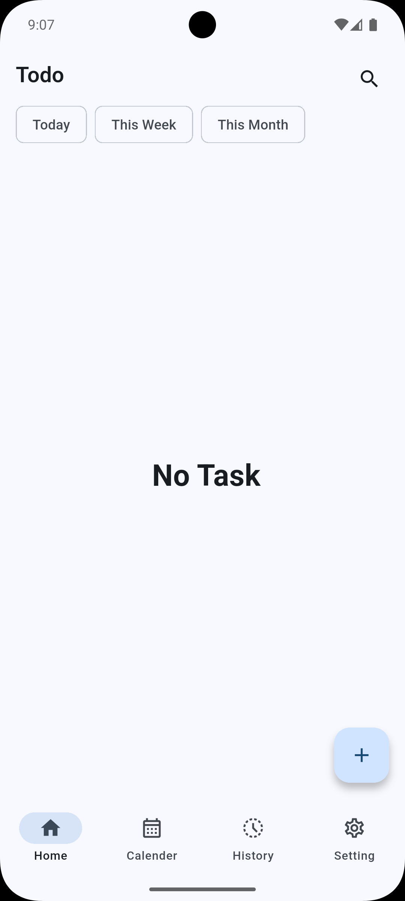
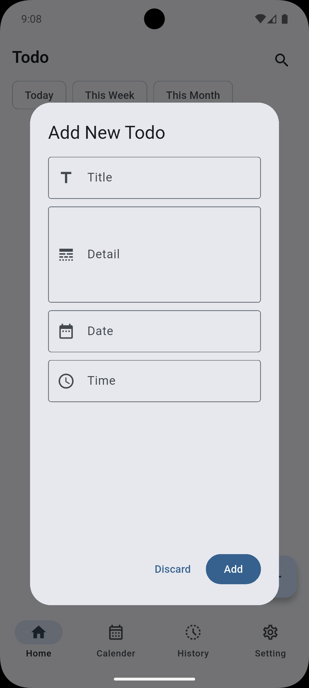
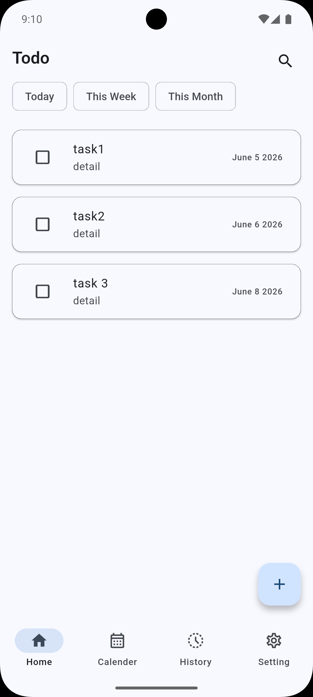
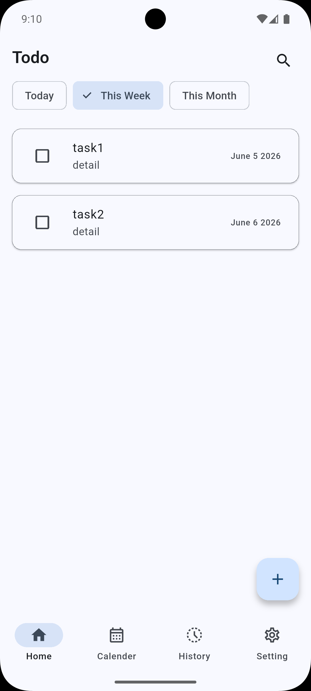
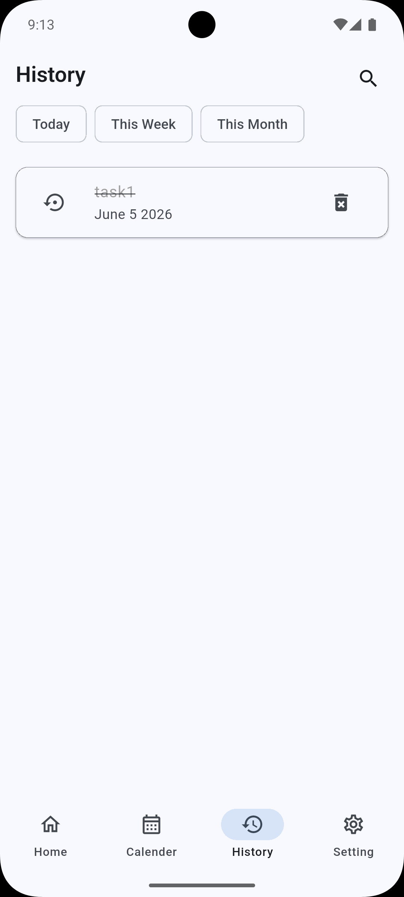
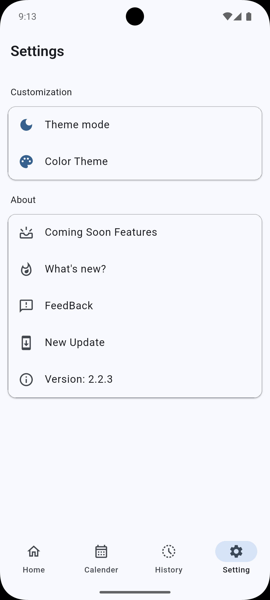
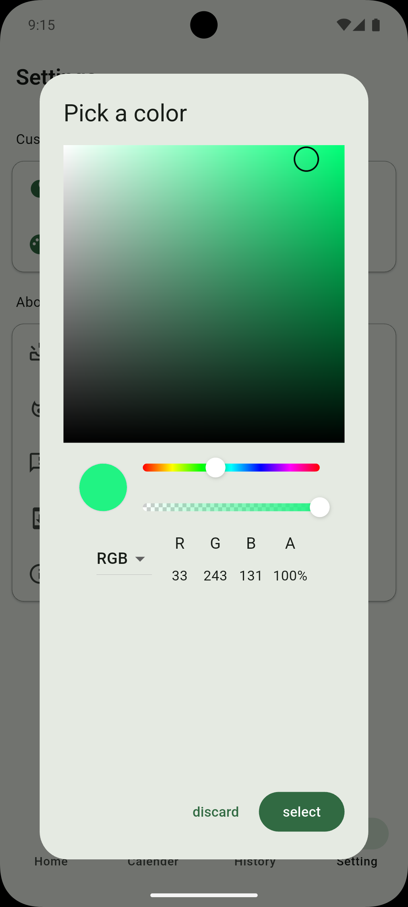

# ✅ Todu — Task Manager App

A feature-rich, offline-first task management app built with **Flutter** and **Material 3**. Create
tasks with deadlines, get reminder notifications, track completion history, and personalize the app
with custom themes — all stored locally on your device.

<div align="center">
  <table>
    <tr>
      <td align="center"><strong>Home</strong></td>
      <td align="center"><strong>Add New Task</strong></td>
      <td align="center"><strong>Tasks List</strong></td>
    </tr>
    <tr>
      <td></td>
      <td></td>
      <td></td>
    </tr>
    <tr>
      <td align="center"><strong>Week Filter</strong></td>
      <td align="center"><strong>Task History</strong></td>
      <td align="center"><strong>Settings</strong></td>
    </tr>
    <tr>
      <td></td>
      <td></td>
      <td></td>
    </tr>
    <tr>
      <td align="center" colspan="3"><strong>Color Picker</strong></td>
    </tr>
    <tr>
      <td align="center" colspan="3"></td>
    </tr>
  </table>
</div>


---

## ✨ Features

### 📋 Task Management

- Create tasks with **title**, **description**, **due date** and **time**
- Tap any task to **edit or reschedule** it with pre-filled fields
- Smart **filter chips** — view tasks due *Today*, *This Week*, or *This Month*
- Form validation ensures no incomplete tasks are created

### 📅 Calendar View

- Full **monthly calendar** powered by `table_calendar`
- Today's date highlighted automatically with theme-colored selection
- Tap any date to view tasks scheduled for that day

### 🔔 Smart Notifications

- **Scheduled reminders** at the exact due date and time
- **"Mark as Done"** action button directly on the notification — works even when the app is closed
- Timezone-aware scheduling for accuracy
- Supports Android 12+ exact alarm permissions

### 📜 Task History

- Dedicated screen for all **completed tasks**
- **Restore** any completed task back to the active list
- **Permanently delete** tasks you no longer need
- Same filter chips: *Today*, *This Week*, *This Month*

### 🎨 Personalization

- **Light & Dark mode** toggle — persisted via SharedPreferences
- **Custom accent color** via a full color picker — persisted across sessions
- Powered by Material 3 dynamic `ColorScheme.fromSeed()`

### ⚙️ Settings

- **What's New** — changelog of recent updates
- **Coming Soon** — preview of upcoming features
- **Send Feedback** — opens email client with pre-filled template
- **Check for Updates** — links to GitHub Releases
- **Version display** — loaded dynamically at runtime

---

## 🛠️ Tech Stack

- **Framework:** [Flutter](https://flutter.dev/) (SDK ^3.10.7) with Material 3
- **State Management:** [Provider](https://pub.dev/packages/provider)
- **Local Database:** [sqflite](https://pub.dev/packages/sqflite)
- **Notifications:
  ** [flutter_local_notifications](https://pub.dev/packages/flutter_local_notifications)
- **Calendar:** [table_calendar](https://pub.dev/packages/table_calendar)
- **Animations:** [Lottie](https://pub.dev/packages/lottie)
- **Theming:
  ** [flutter_colorpicker](https://pub.dev/packages/flutter_colorpicker) + [shared_preferences](https://pub.dev/packages/shared_preferences)
- **Utilities:** `intl` · `timezone` · `path_provider` · `path` · `package_info_plus` ·
  `url_launcher` · `toastification`

---

## 📁 Project Structure

```
lib/
├── Models/
│   ├── task.dart                 # Task model with SQLite serialization
│   ├── FilterModules.dart        # Today / Weekly / Monthly filter logic
│   └── const/Constants.dart      # SharedPreferences & DB column keys
├── ViewModel/
│   ├── Task_provider.dart        # CRUD, filtering, notifications, undo
│   └── ThemeMode_provider.dart   # Light/dark mode & accent color persistence
├── Services/
│   ├── Local/DBHelper.dart       # Singleton SQLite database manager
│   ├── Local/Noti_Services.dart  # Scheduled notifications with action buttons
│   ├── FeedBack/FeedBack.dart    # Email feedback launcher
│   ├── FeedBack/UpdateURL.dart   # GitHub releases URL launcher
│   └── Validator.dart            # Form field validation
├── Pages/
│   ├── Navigator_page.dart       # Bottom nav shell with PageView transitions
│   ├── Home_page.dart            # Active task list with filters & FAB
│   ├── Calender_page.dart        # Monthly calendar view
│   ├── History_page.dart         # Completed tasks with restore & delete
│   └── Settings_page.dart        # Theme, updates, feedback, about
├── Widgets/
│   ├── TodoForm.dart             # AlertDialog form for create/edit tasks
│   ├── AppBarChips.dart          # Reusable filter chip row
│   ├── Home_List_Builder.dart    # Active task list builder
│   ├── History_List_Builder.dart # Completed task list builder
│   └── Ui_ColorPicker.dart       # Color picker dialog
└── main.dart                     # Entry point & provider setup
```

---

## 🏁 Getting Started

### Prerequisites

- Flutter SDK (≥ 3.10.7)
- Android or iOS emulator / physical device

### Installation

1. **Clone the repository:**
   ```bash
   git clone https://github.com/Smit01-State/TODO-App.git
   ```
2. **Install dependencies:**
   ```bash
   cd TODO-App
   flutter pub get
   ```
3. **Run the app:**
   ```bash
   flutter run
   ```

---

## ⚙️ CI/CD

Automated via **GitHub Actions** — on every push to `main`:

1. Builds a **signed release APK**
2. Creates a **GitHub Release** with the APK attached
3. Skips if the version is already released

---

## 🔮 Roadmap

- [ ] **Search** — full-text search across all tasks
- [ ] **Google Data Sync** — synchronize tasks across devices
- [ ] **Cloud Backup** — Firebase / Google Drive integration
- [ ] **Recurring Tasks** — daily, weekly, monthly repeat options

---

## 🤝 Contributing

Contributions are welcome! Feel free to:

- Open an [Issue](https://github.com/Smit01-State/TODO-App/issues) for bugs or suggestions
- Submit a [Pull Request](https://github.com/Smit01-State/TODO-App/pulls) with improvements
- Send feedback directly from the app — **Settings → Feedback**

---

## 📄 License

This project is open source and available under the [MIT License](LICENSE).
